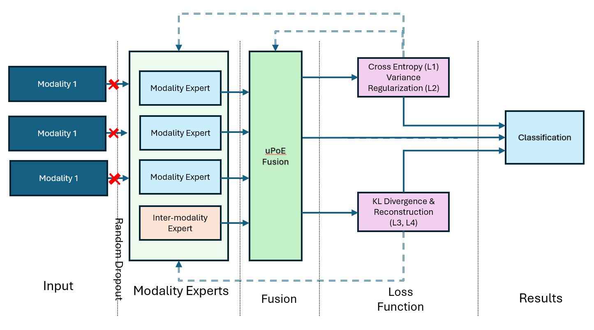

# UW‑VAE I2M2 — Data for AAAI Submission

**This repository contains only the datasets and preprocessing scripts  
needed for reproducing the experiments in our AAAI‑25 submission**  
“Weighted Fusion Multimodal Learning Under Missing Data”.  
_Do not_ publish the manuscript or figures here—only data and code.

---

## 📂 Repository Structure

.
├── README.md  
├── data/  
│   ├── avmnist/  
│   ├── flickr30k/  
│   ├── ul_dd/  
│   └── coco_derived/  
├── scripts/  
│   ├── preprocess_avmnist.py  
│   ├── preprocess_flickr.py  
│   └── preprocess_uldd.py  
├── Pictures/  
│   └── arch.png            # UW‑VAE I2M2 architecture diagram  
└── LICENSE  

---

## 🏛 Architecture

Below is the high‑level architecture of the UW‑VAE I2M2 model.  
Place the PNG version of your `arch.pdf` here as `Pictures/arch.png`.

---

## 🚀 Quick Start

1. **Clone the repo**  
   git clone https://github.com/yourusername/CVAE.git  
   cd CVAE  

2. **Install dependencies**  
   pip install -r requirements.txt  

3. **Download raw data** (see each `data/<dataset>/README.txt` for instructions)  

4. **Run preprocessing**  
   python scripts/preprocess_avmnist.py  
   python scripts/preprocess_flickr.py  
   python scripts/preprocess_uldd.py  

5. **Verify splits**  
   Check `data/<dataset>/splits/{train,val,test}.txt` for reproducible splits.

---

## 🔍 Data Description

- **AV‑MNIST**: paired 28×28 MNIST images & 28‑bin spectrograms  
- **Flickr30k**: 31,783 images + first crowd‑sourced caption  
- **UL‑DD**: biometric signals (EDA, BVP, TEMP, SPO₂) & facial cues (landmarks, FAUs) with 60 s windows

---

## 🛡️ License

Provided for **review purposes only** under AAAI data‑sharing policy.  
_Do not_ redistribute beyond the review committee.

---

## 🙋 Contact

For questions about data access or preprocessing, contact:  
**Majid Hosseini** — Majid.Hosseini@louisiana.edu
